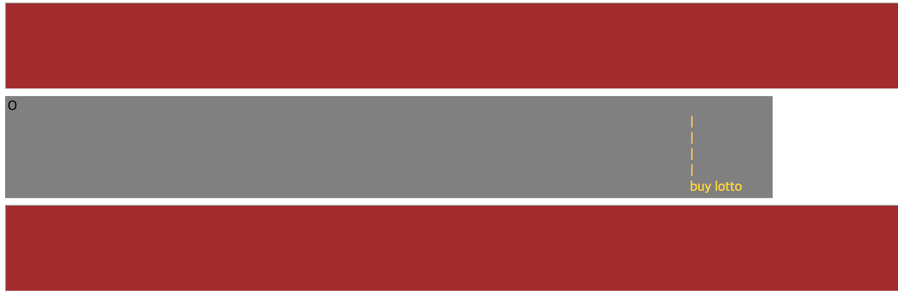
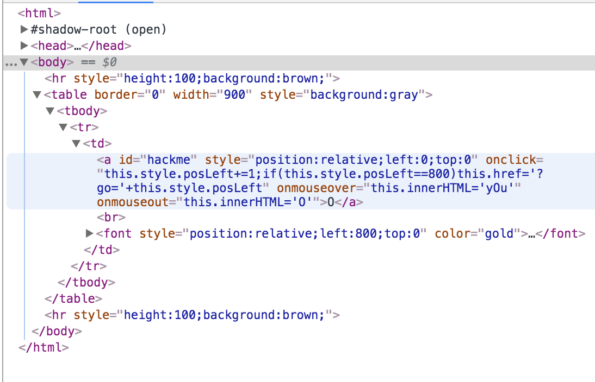

# webhacking.kr - 10번문제(250)

로또를 사라고 한다.

O라는 글자 위에 마우스를 갖다대면 "YOU"라고 하는 것을 보아 저 O가 말인 것 같다.

결승선을 넘으면 되는 것 같다.

이럴때는 개발자 도구를 써 주시면 되겠다.

떡하니 posLeft가 800이면 링크를 연결시켜준다고 적혀있다... 옮겨주자.

단, 클릭시 좌표가 1씩 늘어나므로 그것을 고려해서 799만큼 땡겨주면 되겠다.

※ 크롬 환경에선는 아예 작동하지 않는다. 다른 브라우저를 이용해줍시다.