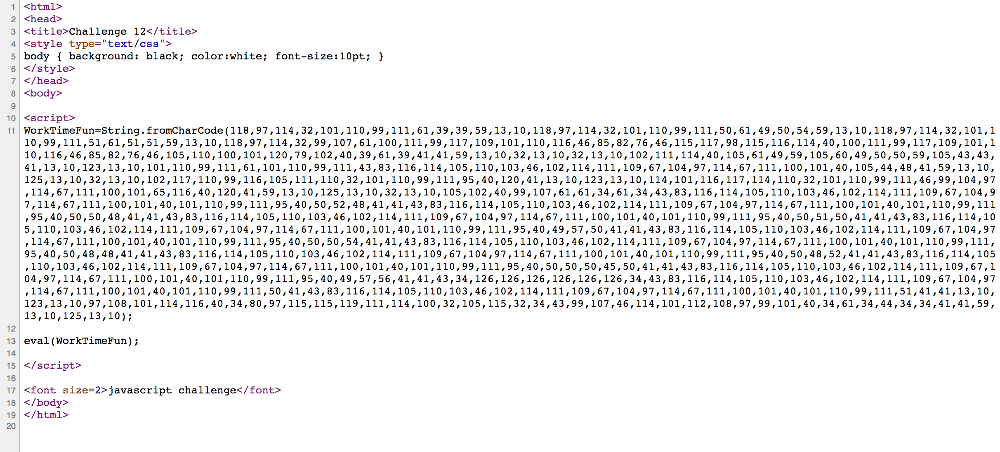
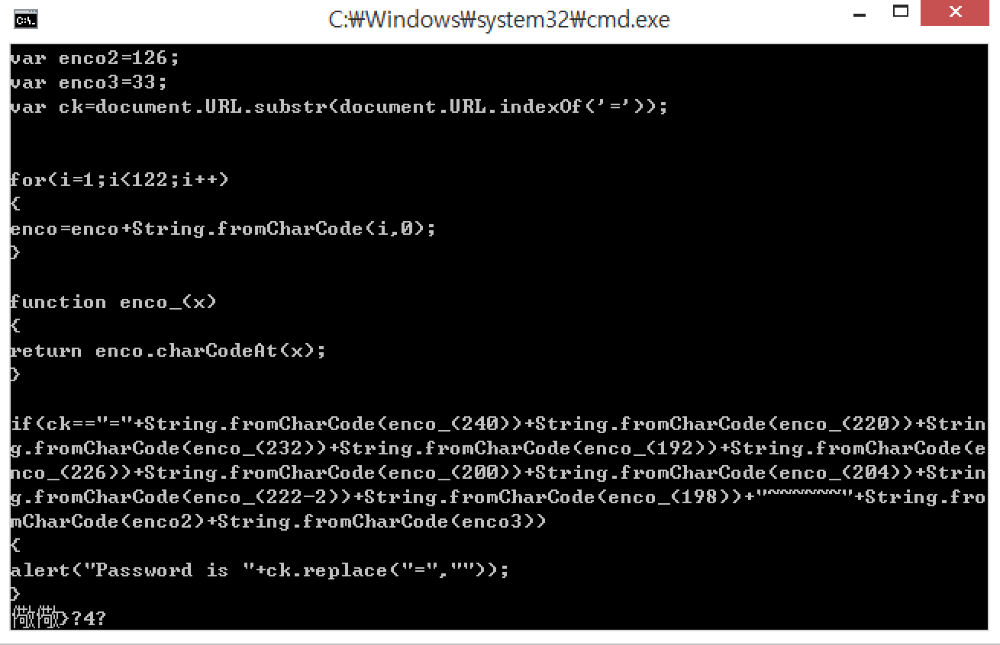
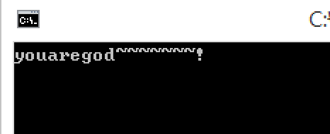

# webhacking.kr - 12번문제(250)

자바스크립트 챌린지라고 한다. 별 다른것이 없으므로 소스보기는 필수



뭔가 잔뜩 나온다. 


근데 값을 보면 대충 ASCII같다.

```c
#include <stdio.h>
#include <Windows.h>

int main(){
	system("cls");

	char s[] = { 118, 97, 114, 32, 101, 110, 99, 111, 61, 39, 39, 59, 13, 10, 118, 97, 114, 32, 101, 110, 99, 111, 50, 61, 49, 50, 54, 59, 13, 10, 118, 97, 114, 32, 101, 110, 99, 111, 51, 61, 51, 51, 59, 13, 10, 118, 97, 114, 32, 99, 107, 61, 100, 111, 99, 117, 109, 101, 110, 116, 46, 85, 82, 76, 46, 115, 117, 98, 115, 116, 114, 40, 100, 111, 99, 117, 109, 101, 110, 116, 46, 85, 82, 76, 46, 105, 110, 100, 101, 120, 79, 102, 40, 39, 61, 39, 41, 41, 59, 13, 10, 32, 13, 10, 32, 13, 10, 102, 111, 114, 40, 105, 61, 49, 59, 105, 60, 49, 50, 50, 59, 105, 43, 43, 41, 13, 10, 123, 13, 10, 101, 110, 99, 111, 61, 101, 110, 99, 111, 43, 83, 116, 114, 105, 110, 103, 46, 102, 114, 111, 109, 67, 104, 97, 114, 67, 111, 100, 101, 40, 105, 44, 48, 41, 59, 13, 10, 125, 13, 10, 32, 13, 10, 102, 117, 110, 99, 116, 105, 111, 110, 32, 101, 110, 99, 111, 95, 40, 120, 41, 13, 10, 123, 13, 10, 114, 101, 116, 117, 114, 110, 32, 101, 110, 99, 111, 46, 99, 104, 97, 114, 67, 111, 100, 101, 65, 116, 40, 120, 41, 59, 13, 10, 125, 13, 10, 32, 13, 10, 105, 102, 40, 99, 107, 61, 61, 34, 61, 34, 43, 83, 116, 114, 105, 110, 103, 46, 102, 114, 111, 109, 67, 104, 97, 114, 67, 111, 100, 101, 40, 101, 110, 99, 111, 95, 40, 50, 52, 48, 41, 41, 43, 83, 116, 114, 105, 110, 103, 46, 102, 114, 111, 109, 67, 104, 97, 114, 67, 111, 100, 101, 40, 101, 110, 99, 111, 95, 40, 50, 50, 48, 41, 41, 43, 83, 116, 114, 105, 110, 103, 46, 102, 114, 111, 109, 67, 104, 97, 114, 67, 111, 100, 101, 40, 101, 110, 99, 111, 95, 40, 50, 51, 50, 41, 41, 43, 83, 116, 114, 105, 110, 103, 46, 102, 114, 111, 109, 67, 104, 97, 114, 67, 111, 100, 101, 40, 101, 110, 99, 111, 95, 40, 49, 57, 50, 41, 41, 43, 83, 116, 114, 105, 110, 103, 46, 102, 114, 111, 109, 67, 104, 97, 114, 67, 111, 100, 101, 40, 101, 110, 99, 111, 95, 40, 50, 50, 54, 41, 41, 43, 83, 116, 114, 105, 110, 103, 46, 102, 114, 111, 109, 67, 104, 97, 114, 67, 111, 100, 101, 40, 101, 110, 99, 111, 95, 40, 50, 48, 48, 41, 41, 43, 83, 116, 114, 105, 110, 103, 46, 102, 114, 111, 109, 67, 104, 97, 114, 67, 111, 100, 101, 40, 101, 110, 99, 111, 95, 40, 50, 48, 52, 41, 41, 43, 83, 116, 114, 105, 110, 103, 46, 102, 114, 111, 109, 67, 104, 97, 114, 67, 111, 100, 101, 40, 101, 110, 99, 111, 95, 40, 50, 50, 50, 45, 50, 41, 41, 43, 83, 116, 114, 105, 110, 103, 46, 102, 114, 111, 109, 67, 104, 97, 114, 67, 111, 100, 101, 40, 101, 110, 99, 111, 95, 40, 49, 57, 56, 41, 41, 43, 34, 126, 126, 126, 126, 126, 126, 34, 43, 83, 116, 114, 105, 110, 103, 46, 102, 114, 111, 109, 67, 104, 97, 114, 67, 111, 100, 101, 40, 101, 110, 99, 111, 50, 41, 43, 83, 116, 114, 105, 110, 103, 46, 102, 114, 111, 109, 67, 104, 97, 114, 67, 111, 100, 101, 40, 101, 110, 99, 111, 51, 41, 41, 13, 10, 123, 13, 10, 97, 108, 101, 114, 116, 40, 34, 80, 97, 115, 115, 119, 111, 114, 100, 32, 105, 115, 32, 34, 43, 99, 107, 46, 114, 101, 112, 108, 97, 99, 101, 40, 34, 61, 34, 44, 34, 34, 41, 41, 59, 13, 10, 125, 13, 10 };
	for (int i = 0; i < strlen(s); i++)
		printf("%c", s[i]);

	while(1);

	return 0;
}
```



enco의 2n번째 값이 n + 1이므로 순서대로 121, 111, 117, 97, 114, 101, 103, 111, 100

```c
#include <stdio.h>
#include <Windows.h>

int main(){
	system("cls");

	printf("%c",121);
	printf("%c",111);
	printf("%c",117);
	printf("%c",97);
	printf("%c",114);
	printf("%c",101);
	printf("%c",103);
	printf("%c",111);
	printf("%c~~~~~~~!",100);


	while(1);

	return 0;
}
```



flag is youaregod~\~\~\~~~~!

