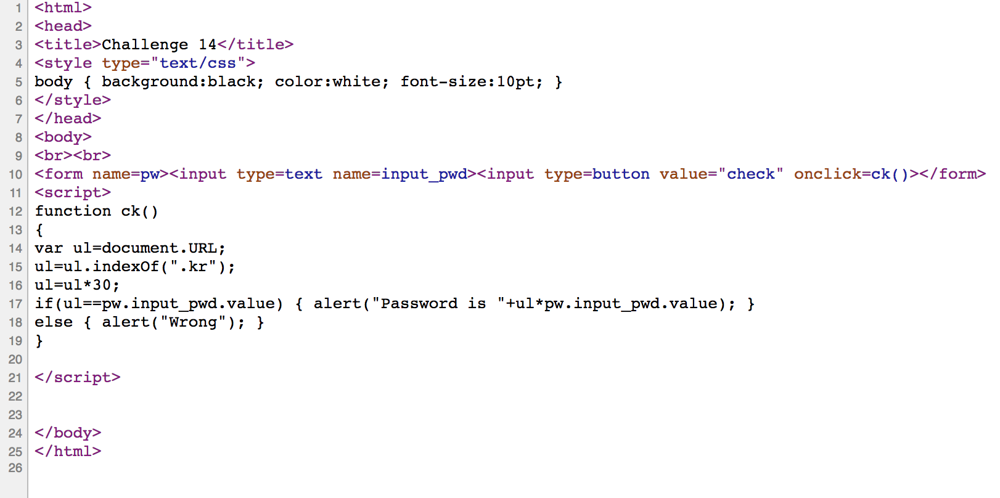
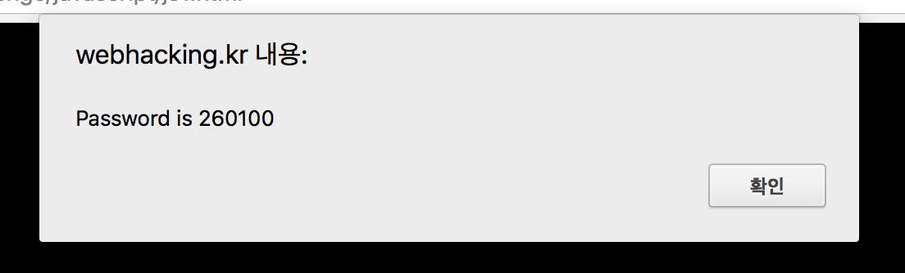

# webhacking.kr - 14번문제(100)

또 뭔가 입력하는 문제다.

indexOf(".kr") * 30의 제곱이 정답이다.

주소가 http://http://webhacking.kr/challenge/javascript/js1.html이므로 indexOf(".kr")의 값은 17이고, 따라서 ul = 510이어야 한다. 

※ 요즘 브라우저는 http://를 생략해서 보여주므로 주의하자.

flag is 260100

