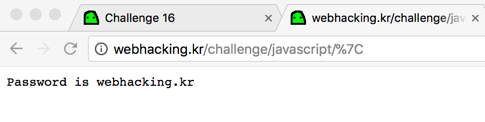

# webhacking.kr - 16번문제(100)

js 문제이다.

```html
<html>
<head>
<title>Challenge 16</title>
<body bgcolor=black onload=kk(1,1) onkeypress=mv(event.keyCode)>
<font color=silver id=c></font>
<font color=yellow size=100 style=position:relative id=star>*</font>
<script> 
document.body.innerHTML+="<font color=yellow id=aa style=position:relative;left:0;top:0>*</font>";

function mv(cd)
{
kk(star.style.posLeft-50,star.style.posTop-50);
if(cd==100) star.style.posLeft=star.style.posLeft+50;
if(cd==97) star.style.posLeft=star.style.posLeft-50;
if(cd==119) star.style.posTop=star.style.posTop-50;
if(cd==115) star.style.posTop=star.style.posTop+50;
if(cd==124) location.href=String.fromCharCode(cd);
}


function kk(x,y)
{
rndc=Math.floor(Math.random()*9000000);
document.body.innerHTML+="<font color=#"+rndc+" id=aa style=position:relative;left:"+x+";top:"+y+" onmouseover=this.innerHTML=''>*</font>";
}

</script>
</body>
</html>

```

소스가 이렇다. event.keyCode라는 값을 받아와서 그 값에 따라 함수를 실행해준다.

근데 event.keyCode는 안봐도 키보드 이벤트인게 뻔히 보인다.


124는 "|" 키이다. 눌러주자



flag is webhacking.kr