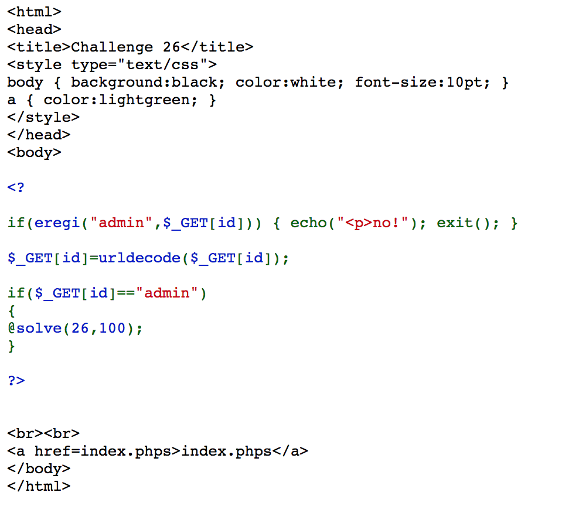

# webhacking.kr - 26번문제(100)

id의 값이 admin이면 된다고 한다. 그런데 "admin" 문자열을 그대로 쓰면 eregi에 걸린다.

그리고 urldecode를 한번 한다.

즉 urldecode한 값이 "admin", 즉 %61%64%6d%69%6e라는 값을 가지면 된다.

http://webhacking.kr/challenge/web/web-11/?id=%2561%2564%256d%2569%256e

로 가 주자.

※ '%'의 아스키코드는 0x25

