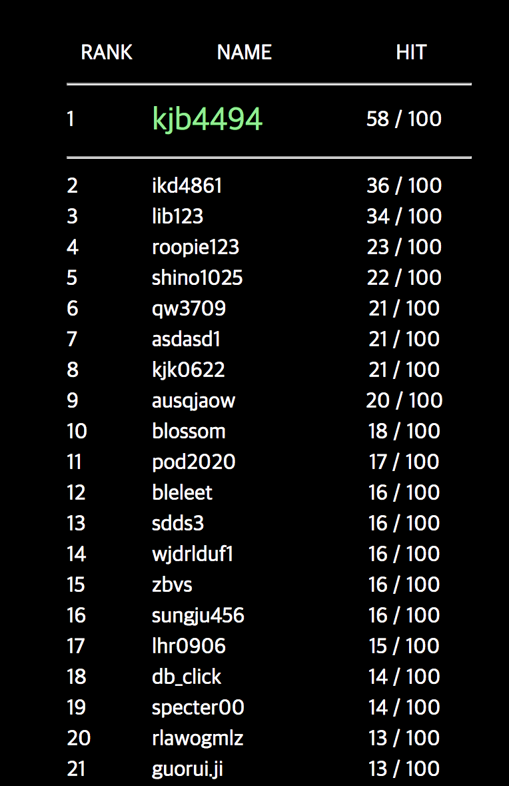
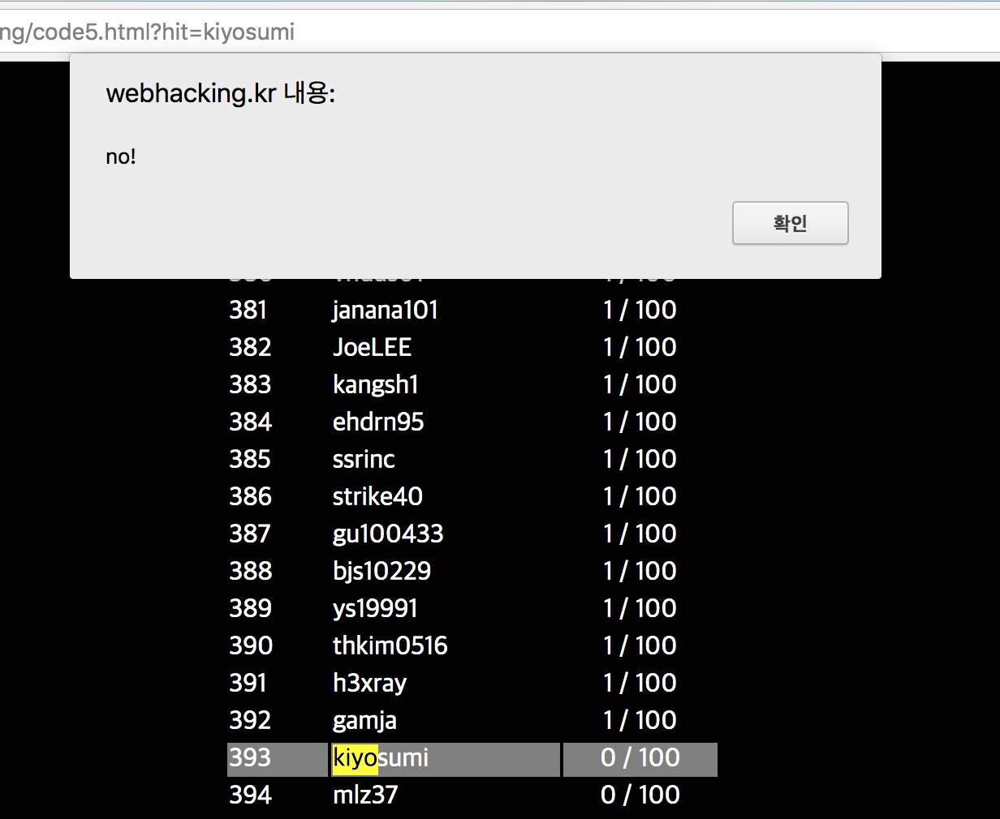
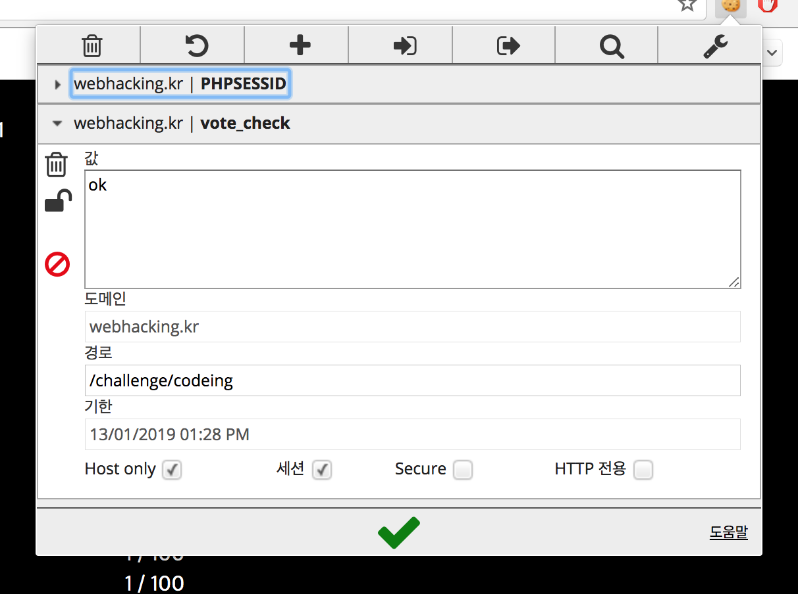
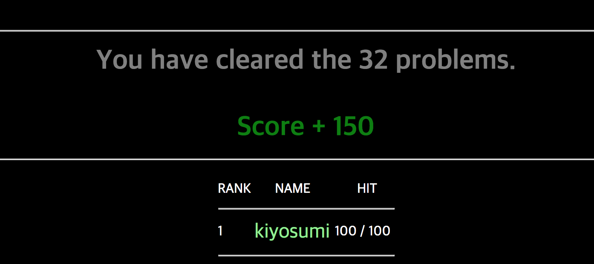

# webhacking.kr - 32번문제(150)



이렇게 뜨고 맨 아래에 Join 버튼이 있는데, 클릭 시 랭킹에 자신의 아이디가 등록된다.

자신의 아이디를 클릭해보면 



이렇게 뜬다. 



쿠키때문이다. 쿠키를 제거하고 클릭시 숫자가 잘 오른다.

어떤 수단이든 적당히 사용해서 100번 클릭하면 될 것이다.


### Solution Code

```python
from socket import *
from urllib2 import *
from string import *
import urllib2, re, time

for i in range(0, 100):
	url = "http://webhacking.kr/challenge/codeing/code5.html?hit=kiyosumi"
	headers = {"Cookie":"vote_check=''", "Cookie":"PHPSESSID=be09fc532e4e9dbe08b7f30229a1e6b0"}
	request = urllib2.Request(url, None, headers)
	response = urllib2.urlopen(request)
```

