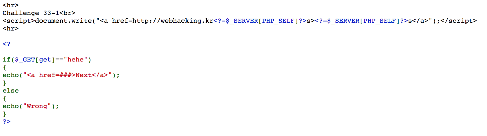
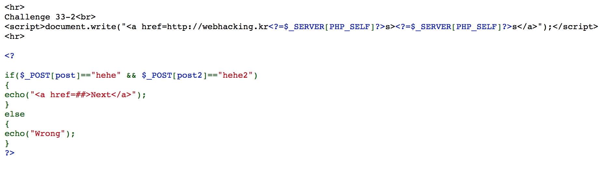
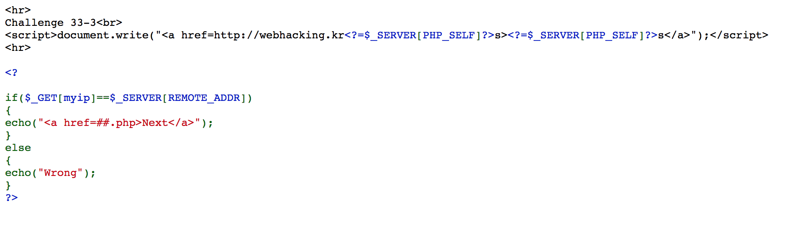
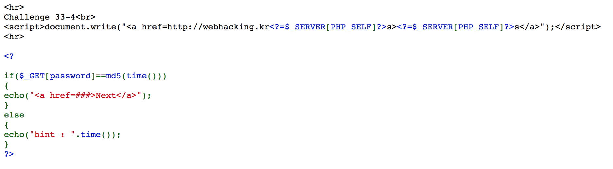
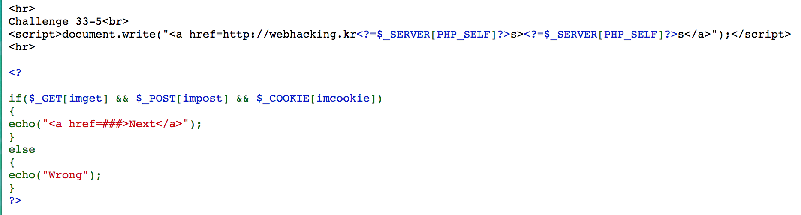
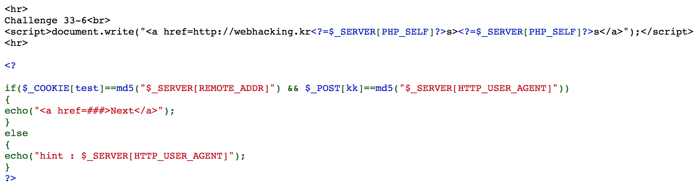
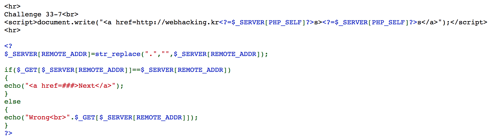
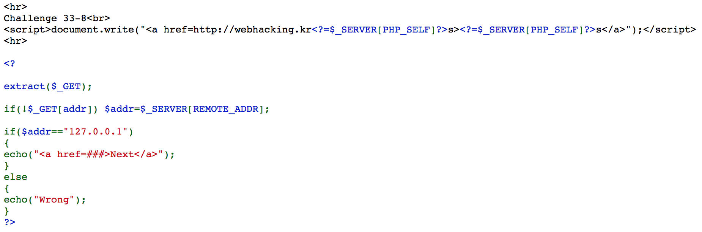
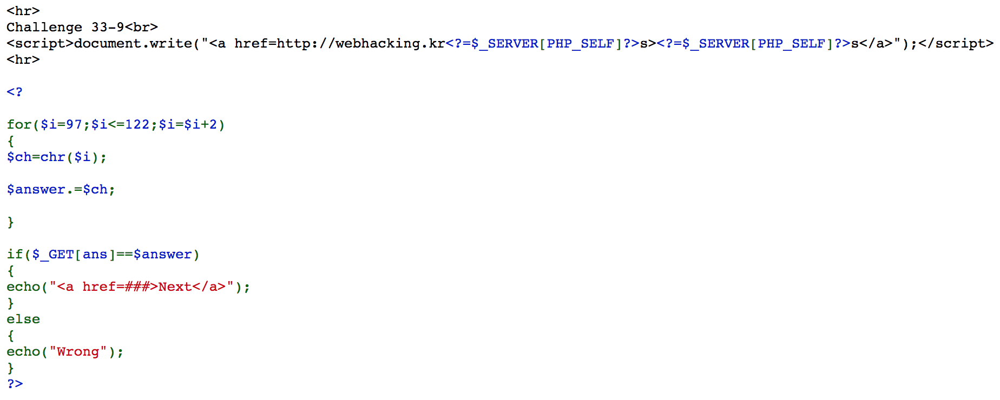
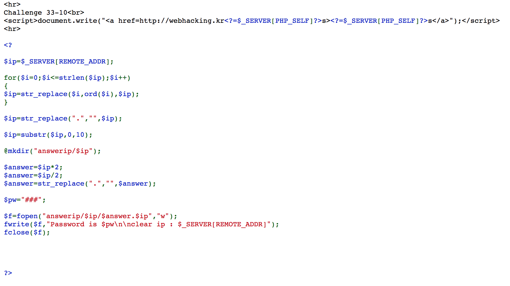

# webhacking.kr - 33번문제(200)

다단계 문제이다.


❖ 1단계



GET 형식으로 보내주자.

http://webhacking.kr/challenge/bonus/bonus-6/?get=hehe


❖ 2단계



POST 형식으로 2개 보내주자.

```html
<form method=post action="http://webhacking.kr/challenge/bonus/bonus-6/lv2.php">
  <input type=text name="post" size=10>
  <input type=text name="post2" size=10>
  <input type=submit value="전송">
</form>
```


❖ 3단계



GET형식으로 아이피를 전달해주자.


❖ 4단계



hint를 통해 적절히 몇 초후 시간을 돌려놓고 기다리자. 아니면 프로그래밍을 이용해도 괜찮다.

다만 정확한 작업이 필요한 것은 아니기에 필자는 그냥 대기탔다.


❖ 5단계



일단 imcookie란 쿠키를 미리 만들어두고

```html
<form method=post action="http://webhacking.kr/challenge/bonus/bonus-6/md555.php?imget=hello">
  <input type=text name="impost" size=10>
  <input type=submit value="전송">
</form>
```

당기자.


❖ 6단계



아이피는 아까 구했으니 그대로 넣어주고, hint로 $_SERVER[HTTP_USER_AGENT] 의 값도 보여주니 암호화 해서 넣어주자.


❖ 7단계



자기 ip에서 "."을 뺀 값을 X라고 하면, X라는 이름의 변수의 값이 X이면 되는 것이다.


ex) 127.0.0.1 -> address?127001=127001


❖ 8단계



그냥 "127.0.0.1" 값을 넣어주면 되겠다.


❖ 9단계



97 = 0x61 = 'a', 121 = 0x79 = 'y'

answer is acegikmoqsuwy


❖ 10단계



직접 구해도 되지만 복붙하자.

```php
<?php

$ip="본인 IP";

for($i=0;$i<=strlen($ip);$i++)
{
$ip=str_replace($i,ord($i),$ip);
}

$ip=str_replace(".","",$ip);

$ip=substr($ip,0,10);

@mkdir("answerip/$ip");

$answer=$ip*2;
$answer=$ip/2;
$answer=str_replace(".","",$answer);

echo $answer;
echo $ip;

?>
```

그럼 패스워드가 뜬다.