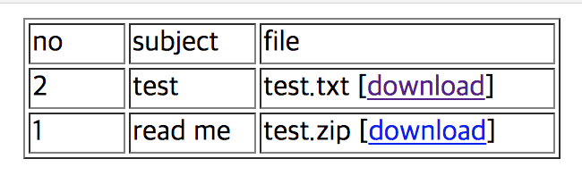
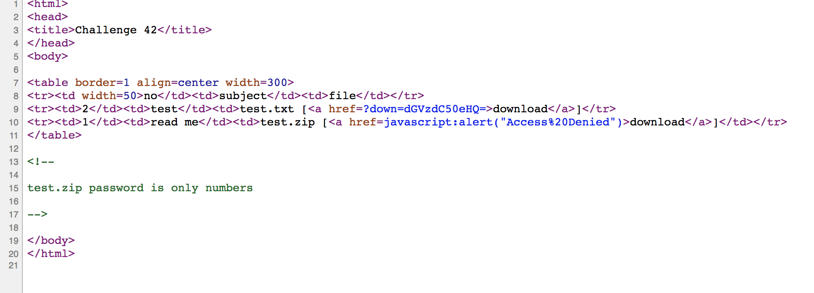
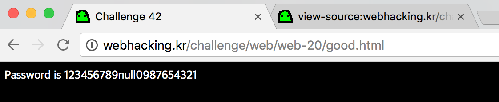

# webhacking.kr - 42번문제(200)

파일 두개가 있고, 아무래도 test.zip을 읽어야 하는 것 같다. 그러나 download를 누르면 접근 불가라고 뜬다.

소스를 보자.

dGVzdC50eHQ=는 "test.zip"을 base64로 한 번 인코딩 한 문자열임을 알 수 있고, 이를 통해 test.zip을 다운받는 방법도 대충 알 수 있다.

즉 "test.zip"을 한 번 인코딩하고 주소 맨 끝에 붙여주면 되겠다.

※ http://webhacking.kr/challenge/web/web-20/?down=dGVzdC56aXA=

비밀번호는 숫자만으로 되어있다는 힌트를 적용하여 적당히 브루트포싱해주자. (정답 852)

flag is 123456789null0987654321